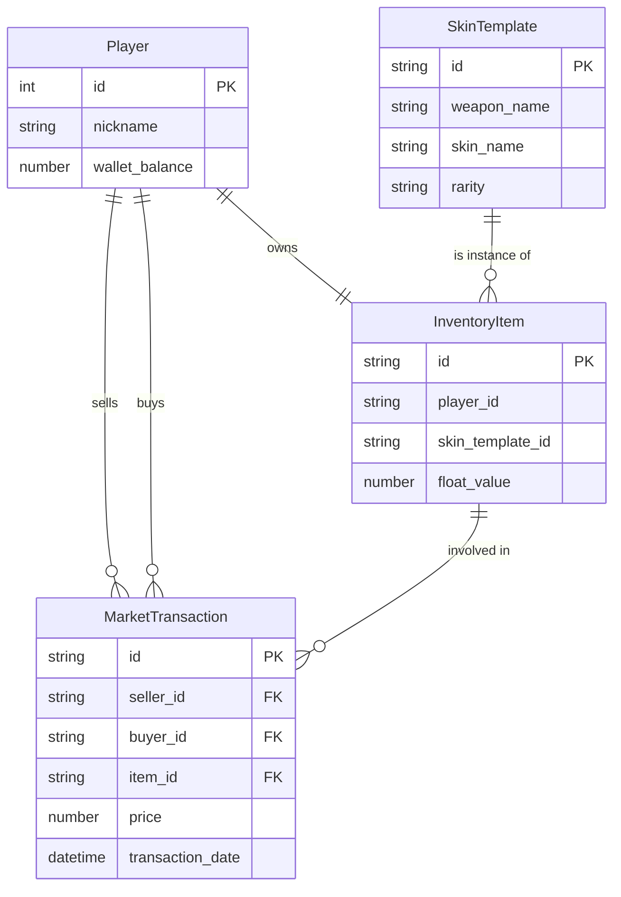

Згенеруй ER-діаграму у форматі Mermaid для домену 'Маркетплейс ігрових предметів' на основі мого spec.md. Використовуй правильні типи даних, познач ключі та зв'язки.

```mermaid
erDiagram
    Player {
        int id PK
        string nickname
        number wallet_balance
    }

    SkinTemplate {
        string id PK
        string weapon_name
        string skin_name
        string rarity
    }

    InventoryItem {
        string id PK
        string player_id
        string skin_template_id
        number float_value
    }

    MarketTransaction {
        string id PK
        string seller_id FK
        string buyer_id FK
        string item_id FK
        number price
        datetime transaction_date
    }

    Player ||--|| InventoryItem : "owns"
    SkinTemplate ||--o{ InventoryItem : "is instance of"
    Player ||--o{ MarketTransaction : "sells"
    Player ||--o{ MarketTransaction : "buys"
    InventoryItem ||--o{ MarketTransaction : "involved in"
```
